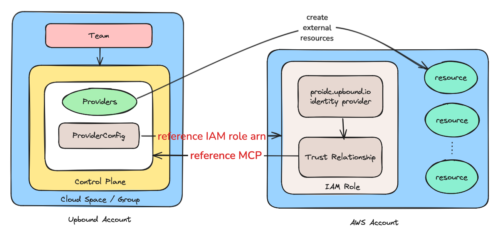
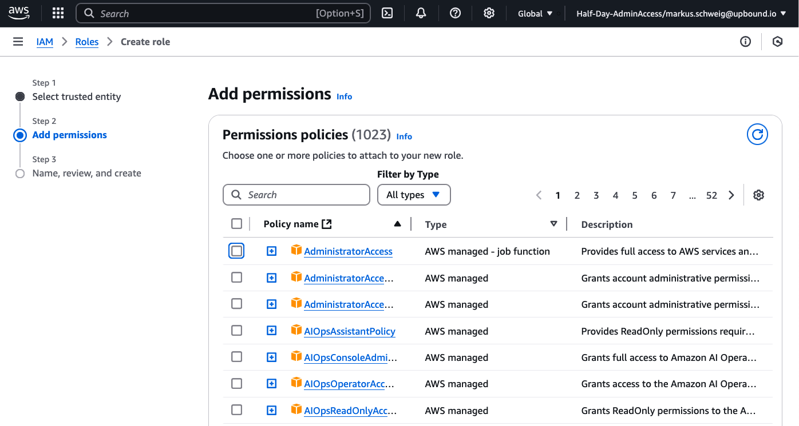

# Python DevEx For AI

This lab shows how to use
[Upbound tooling](https://docs.upbound.io/reference/cli/)
with embedded Python functions to
create an AI playground in Amazon AWS. You'll be able to run preloaded
[HuggingFace](https://huggingface.co/) examples, including language
translators and predictions.

## Goal

Ability to create and manage the AWS virtual machine and network infrastructure
required to run Hugging Face Neuron Deep Learning exercises. Users will be
able to claim the various networks and virutal machines that will reside
in those networks. They will then be able to log in to the
virtual machines and use their AI playground.

## Curriculum

In this Python DevEx for AI Upbound lab, we will learn how to
- [ ] Create a Crossplane configuration package that implements an AI playground
  platform.
- [ ] Create example network and virtual machine resource claims.
- [ ] Create Crossplane platform APIs from Custom Resource Definitions (`XRD`).
- [ ] Create Crossplane compositions with function pipelines.
- [ ] Add Kubernetes provider controller dependencies and use the providers.
- [ ] Let providers authenticate to an AWS account with Open ID Connect (`OIDC`) and
  static credentials.
- [ ] Create embedded Crossplane Python functions.
- [ ] Import and use provider models.
- [ ] Create managed resources within the Crossplane Python functions.
- [ ] Patch input validation status information to compsite resources.
- [ ] Dynamically update external resources.
- [ ] Reference and use managed and external resources through selectors.
- [ ] Explore a HuggingFace sentence completion predition.
- [ ] Best practices.

## Prerequisites

You will need
- A free or higher tier [Upbound account](https://www.upbound.io/register/a)
- The [up cli](https://docs.upbound.io/reference/cli/)
- The [crossplane cli](https://docs.crossplane.io/latest/cli/)
- [kubectl](https://kubernetes.io/docs/tasks/tools/)
- An editor, prefrearbly with [Language Server Protocol](https://microsoft.github.io/language-server-protocol/)(`LSP`) support like [VS Code](https://code.visualstudio.com/)

## Resources

The AI playground consists of foundational network,
and elastic compute virtual machine resources.

### Network

Network resources are:
- VPC
- Subnets
- Intenet Gateway
- Route
- Route Table
- Route Table Associations
- Main Route Table Association
- Security Group
- Security Group Rules for outbound ICMP, TCP, UDP, and inbound [SSH](https://en.wikipedia.org/wiki/Secure_Shell)

An example VPC, subnet, route table, Internet gateway resource map is:


The VPC is the AI playground virtual private cloud where one or more subnets
reside that can host virtual machines. The virtual machines are reachable on
port SSH 22 through an inbound security group rule. The AI Upboxes can reach
external endpoints over ICMP, TCP and UDP protocols. In and outbound traffic
routing through a route, route table, and the appropriate associations
facilitate the network communication.

### Compute

Compute resources are:
- Instance
- Key Pair

AI Upboxes take a public SSH key as input so that the user who has the
corresponding private key may connect to them. Each AI Upbox is preconfigured
with 1 `SSH` key for its user. The AI Upbox has a name and it can
be placed in one of many networks that were created for it. AI Upboxes reside
in subnets with matching labels.

## Design

The AI playground design is flexible, because it enables running multiple AI
Upboxes in each network. Imagine an isolated network for different departments
with AI Upboxes for members of the respective groups.

> [!NOTE]
>
> Coincidentally, Upbound has been using the Upbox pattern for training
> purposes, because Upboxes can be configured with the right access and
> materials for a smooth turn key solution for multiple parallel groups
> with proper isolation and security controls.

## Development Workflow

> [!TIP]
> Best Practice
>
> Use modern `up cli` version `0.37.0+` tooling in combination with an Upbound
> account for high velocity embedded Python function programming with
> Crossplane.

> [!NOTE]
>
> Embedded functions are a good fit for implementing logic that is
> specific to a single configuration, i.e. functions that compose a
> specific composition as in the AI playground. Embedded functions are also a
> good starting point in the Crossplane function writing journey.
> For the above scenario, the recommendation is to switch standalone Python
> functions over to embedded functions.
>
> When building general purpose functions that are going to be used
> across multiple configurations, then building standalone functions
> using the [Python SDK](https://github.com/crossplane/function-sdk-python)
> is a good fit. This approach uses `crossplane xpkg ...`

> [!CAUTION]
>
> AWS Cloud resources will be billed by Amazon to your own target account.

We will use the following steps to develop the Upbound AI playground
configuration package.
The list below is a brief overview to familiarize ourselves at a high level. We
will carry out each step in detail in the next sections.
There will be one API for the network, and one for the AI Upbox
virtual machines. This will allow us to create multiple networks and an
arbitrary number of machines per network, and to manage the lifecycle of
machines independently of their networks.

### General
- `up project init configuration-ai-playground`

> [!TIP]
> Best Practice
>
> Create resuable configuration packages that can be imported by other
> configurations, and that import lower level configuration packages themselves.

> [!NOTE]
>
> Update provider versions when they are available in the
> [Upbound Marketplace](https://marketplace.upbound.io/).

### Network
- `up example generate --name network.yaml`
- Update the example
- `up xrd generate examples/network/network.yaml`
- `up dep add xpkg.upbound.io/upbound/provider-aws-ec2:v1.19.0`
- `up composition generate apis/xnetworks/definition.yaml`
- `up function generate --language python compose-upbox-ai`
- Create virtual Python environment in functions directory
- Develop functions code
- Update apis/xnetworks/composition.yaml
- `up project run`
- Claim the network resources
- Validate that we can successfully create the network

### Machines
- `up example generate --name <name>`
- Update the example
- `up xrd generate examples/upbox-ai/<name>`
- `up dep add xpkg.upbound.io/upbound/provider-aws-ec2:v1.19.0`
- `up composition generate apis/xupboxais/definition.yaml`
- `up function generate --language python compose-upbox-ai`
- Create virtual Python environment in functions directory
- Develop functions code
- Update apis/xnetworks/composition.yaml
- `up project run`
- Claim the upbox-ai resources
- Validate that we can successfully create a usable upbox-ai

## Create The Configuration

```shell
up project init configuration-ai-playground
```
```shell
created directory path configuration-ai-playground

initialized package "configuration-ai-playground" in directory "configuration-ai-playground" from https://github.com/upbound/project-template (main)
```

```shell
cd configuration-ai-playground
```

## Create An Example Network Resource Claim

```shell
up example generate --type=claim \
   --api-group=ai.platform.example.org \
   --api-version=v1alpha1 \
   --kind=Network \
   --name=upbox-network-us-east
```
```shell
Successfully created example and saved to /Users/markuss/upbound/dev/go/src/github.com/upbound/sa-up/labs/python-devex-ai/configuration-ai-playground/examples/network/upbox-network-us-east.yaml
```

Let's examine the created example.
```yaml
apiVersion: ai.platform.example.org/v1alpha1
kind: Network
metadata:
  name: upbox-network-us-east
  namespace: default
spec: {}
```
We want to update the `spec` with parameters so that we can create a Composite
Resource Definition (`XRD`) from the example.
```yaml
apiVersion: ai.platform.example.org/v1alpha1
kind: Network
metadata:
  name: upbox-network-us-east
  namespace: default
spec:
  id: ai-and-me-aws-box-network
  region: us-west-1
  vpcCidrBlock: 192.168.0.0/16
  subnets:
    - availabilityZone: us-west-1a
      type: public
      cidrBlock: 192.168.0.0/18
```

### Generate the `XRD`

```shell
up xrd generate examples/network/upbox-network-us-east.yaml
```
```shell
Successfully created CompositeResourceDefinition (XRD) and saved to /Users/markuss/upbound/dev/go/src/github.com/upbound/sa-up/labs/python-devex-ai/configuration-ai-playground/apis/xnetworks/definition.yaml
```
Let's examine our `openAPIV3Schema` API. It contains claim and composite
resource names, and fields for the parameters that we specified above. The
version of our API is `v1alpha1`.
```yaml
apiVersion: apiextensions.crossplane.io/v1
kind: CompositeResourceDefinition
metadata:
  name: xnetworks.ai.platform.example.org
spec:
  claimNames:
    kind: Network
    plural: networks
  group: ai.platform.example.org
  names:
    categories:
    - crossplane
    kind: XNetwork
    plural: xnetworks
  versions:
  - name: v1alpha1
    referenceable: true
    schema:
      openAPIV3Schema:
        description: Network is the Schema for the Network API.
        properties:
          spec:
            description: NetworkSpec defines the desired state of Network.
            type: object
          status:
            description: NetworkStatus defines the observed state of Network.
            type: object
        required:
          - spec
        type: object
    served: true
```
Replace the status field in the `XRD` with:
```yaml
            status:
              description: NetworkStatus defines the observed state of Network.
              type: object
              properties:
                xnetwork:
                  type: object
                  properties:
                    subnets:
                      type: array
                      items:
                        type: object
                      x-kubernetes-preserve-unknown-fields: true
                    vpcCidrBlock:
                      type: string
```
This will allow patching of status messages to `status.xnetwork`,
and specifically the `vpcCidrBlock` and the `subnets`.

> [!TIP]
> Best Practice
>
> Use `x-kubernetes-preserve-unknown-fields: true` to patch unstructured data
> into a field.

Add enumeration to the region to only allow networks where AWS offers the AMIs
that the AI upboxes require.
```yaml
              region:
                type: string
                enum:
                  - ap-southeast-1
                  - eu-central-1
                  - eu-north-1
                  - eu-west-1
                  - sa-east-1
                  - us-east-1
                  - us-west-2
                default: us-east-1
```
> [!TIP]
> Best Practice
>
> `yamlfmt` ensures proper uniform formatting of yaml.

Indicate required fields and add defaults. The entire `XRD
apis/xnetworks/definition.yaml` is:
```yaml
apiVersion: apiextensions.crossplane.io/v1
kind: CompositeResourceDefinition
metadata:
  name: xnetworks.ai.platform.example.org
spec:
  claimNames:
    kind: Network
    plural: networks
  group: ai.platform.example.org
  names:
    categories:
      - crossplane
    kind: XNetwork
    plural: xnetworks
  versions:
    - name: v1alpha1
      referenceable: true
      schema:
        openAPIV3Schema:
          description: Network is the Schema for the Network API.
          properties:
            spec:
              description: NetworkSpec defines the desired state of Network.
              properties:
                id:
                  type: string
                providerConfigName:
                  type: string
                  default: default
                region:
                  type: string
                  enum:
                    - ap-southeast-1
                    - eu-central-1
                    - eu-north-1
                    - eu-west-1
                    - sa-east-1
                    - us-east-1
                    - us-west-2
                  default: us-east-1
                subnets:
                  items:
                    properties:
                      availabilityZone:
                        type: string
                      cidrBlock:
                        type: string
                      type:
                        type: string
                    required:
                      - availabilityZone
                      - cidrBlock
                      - type
                    type: object
                  type: array
                vpcCidrBlock:
                  type: string
              required:
                - id
                - subnets
                - vpcCidrBlock
              type: object
            status:
              description: NetworkStatus defines the observed state of Network.
              type: object
              properties:
                xnetwork:
                  type: object
                  properties:
                    subnets:
                      type: array
                      items:
                        type: object
                      x-kubernetes-preserve-unknown-fields: true
                    vpcCidrBlock:
                      type: string
          required:
            - spec
          type: object
      served: true
```
Let's generate our network composition from the `XRD`. The composition
implements a series of pipeline steps. One of the steps is to call our future
Python function for creating managed resources for our network.

> [!TIP]
> Best Practice
>
> Add multiple embedded Python functions as needed to the configuration each with
> its own virtual Python venv environment.

```shell
up composition generate apis/xnetworks/definition.yaml
```
```shell
successfully created Composition and saved to /Users/markuss/upbound/dev/go/src/github.com/upbound/sa-up/labs/python-devex-ai/configuration-ai-playground/apis/xnetworks/composition.yaml
```
### Generate Python Function.
```shell
up function generate --language python compose-network
```
```shell
  ✓   Checking dependencies
  ✓   Generating Function Folder
successfully created Function and saved to /Users/markuss/upbound/dev/go/src/github.com/upbound/sa-up/labs/python-devex-ai/configuration-ai-playground/functions/compose-network
```
### Build Configuration Package.
```shell
up login
```
> [!TIP]
> Best Practice
>
> When `up login` opens a browser window that shows your organizations
> without returning to the command line prompt, simply log out of
> your browser session and `up login` again from the command line.

```shell
<username> logged in to organization upbound
```
Now that we are logged in we can build and push our configuration.
```shell
up project run
```
```shell
  ✓   Parsing project metadata
  ✓   Checking dependencies
  ✓   Generating language schemas
  ✓   Creating development control plane
  ✓   Building functions
  ✓   Building configuration package
  ✓   Ensuring repository exists
  ✓   Pushing function package xpkg.upbound.io/upbound/configuration-ai-playground_compose-network
  ✓   Pushing configuration image xpkg.upbound.io/upbound/configuration-ai-playground:v0.0.0-1737084367
  ✓   Installing package on development control plane
  ✓   Waiting for package to be ready
```
Now that our new development control plane has been created, let's set our
context so that we can examine it.
```shell
up ctx
```
```shell
  upbound/upbound-gcp-us-central-1/default/

       [groups] ..
 [controlplane] configuration-ai-playground
```
We can use our cursor to move over `configuration-ai-playground` and enter to
select it, and then connect to it.
```shell
 [controlplanes] ..
                 Connect to "configuration-ai-playground" and quit
```
We can verify that our configuration package has been installed and that it is
healthy as follows.
```shell
kubectl get configuration.pkg
```
```shell
NAME                          INSTALLED   HEALTHY   PACKAGE                                                                 AGE
configuration-ai-playground   True        True      xpkg.upbound.io/upbound/configuration-ai-playground:v0.0.0-1737084367   11m
```
Let's add a pipeline step for our Python function to our `apis/xnetworks/composition.yaml`.
```yaml
apiVersion: apiextensions.crossplane.io/v1
kind: Composition
metadata:
  name: xnetworks.ai.platform.example.org
spec:
  compositeTypeRef:
    apiVersion: ai.platform.example.org/v1alpha1
    kind: XNetwork
  mode: Pipeline
  pipeline:
  - functionRef:
      name: upbound-configuration-ai-playgroundcompose-network
    step: compose-network
  - functionRef:
      name: crossplane-contrib-function-auto-ready
    step: crossplane-contrib-function-auto-ready
```
We need a Python venv.
```shell
python3 -m venv functions/compose-network
source functions/compose-network/bin/activate
python3 -m pip install crossplane-function-sdk-python
```
Our resources are created by an Upbound provider. This is a kubernetes
controller. Let's install it as a dependency. This will also add the provider
API information to the `functions/compose-network/mode/io/upbound` folder.
```shell
up dep add xpkg.upbound.io/upbound/provider-aws-ec2:v1.19.0
```
```shell
xpkg.upbound.io/upbound/provider-aws-ec2:v1.19.0 added to cache
xpkg.upbound.io/upbound/provider-aws-ec2:v1.19.0 added to project dependency
```
> [!TIP]
> Best Practice
>
> Conditionally import from dot, e.g. `.model` and without dot, e.g. `model` to
> support Crossplane's need for the leading dot, and local tools that may require
> an import without the dot.
>
> `try:`
> `  from .model.io.k8s.apimachinery.pkg.apis.meta import v1 as metav1`
>
> `  from .model.org.example.platform.ai.network import v1alpha1`
> `  from .model.io.upbound.aws.ec2.vpc import v1beta1 as vpc_v1beta1`
> `except ImportError:`
> `  from model.io.k8s.apimachinery.pkg.apis.meta import v1 as metav1`
>
> `  from model.org.example.platform.ai.network import v1alpha1`
> `  from model.io.upbound.aws.ec2.vpc import v1beta1 as vpc_v1beta1`

Now, that there is a foundation, we can start to program our Python composition
function by editing `functions/compose-network/main.py`. Replace the contents of
the file with the input below.
```python
""" Compose Network - VPC """
from crossplane.function import logging, resource
from crossplane.function.proto.v1 import run_function_pb2 as fnv1

# Add models as import
# Crossplane in cluster imports require leading dot

from .model.io.k8s.apimachinery.pkg.apis.meta import v1 as metav1

from .model.org.example.platform.ai.network import v1alpha1
from .model.io.upbound.aws.ec2.vpc import v1beta1 as vpc_v1beta1


def compose(req: fnv1.RunFunctionRequest, rsp: fnv1.RunFunctionResponse):
    """Function composing managed resources."""

    log=logging.get_logger()
    log.info("upbound-compose-network")

    network_id=provider_config_name=region=vpc_cidr_block=''
    subnets=[]

    observed_xr=v1alpha1.Network(**req.observed.composite.resource)

    # Setting status in case this function is used in combination with an XRD that
    # does not set the id field to be required.
    if observed_xr.spec.id is not None:
        network_id=observed_xr.spec.id
        log.info("network_id:", network_id)
    else:
        resource.update(rsp.desired.composite.resource, {
            "status": {
                "warning": "Please specify spec.id. It is used as the name and identifier of the network",
            },
        })

    # providerConfig defaults to "default" if not specified
    if observed_xr.spec.providerConfigName is not None:
        provider_config_name=observed_xr.spec.providerConfigName
        log.info("provider_config_name:", provider_config_name)

    if observed_xr.spec.region is not None:
        region=observed_xr.spec.region
        log.info("region:", region)

    if observed_xr.spec.vpcCidrBlock is not None:
        vpc_cidr_block=observed_xr.spec.vpcCidrBlock
        log.info("vpc_cidr_block:", vpc_cidr_block)

    if observed_xr.spec.subnets is not None:
        subnets=observed_xr.spec.subnets
        log.info("subnets:", subnets)

    # VPC
    vpc=vpc_v1beta1.VPC(
        apiVersion="ec2.aws.upbound.io/v1beta1",
        kind="VPC",
        metadata=metav1.ObjectMeta(
            labels={
              "networks.aws.platform.upbound.io/id": network_id
            },
            name="vpc"
        ),
        spec=vpc_v1beta1.Spec(
            forProvider=vpc_v1beta1.ForProvider(
                cidrBlock=vpc_cidr_block,
                enableDnsHostname=True,
                enableDnsSupport=True,
                region=region,
                tags={
                    "Name": observed_xr.metadata.name,
                    "region": region
                }
            ),
            providerConfig=vpc_v1beta1.ProviderConfigRef(
                name=provider_config_name
            )
        )
    )
    resource.update(rsp.desired.resources["vpc"], vpc)
    log.info("vpc updated")

    return rsp
```
Now build and push the package again.
```shell
up project run
  ✓   Parsing project metadata
  ✓   Checking dependencies
  ✓   Generating language schemas
  ✓   Building functions
  ✓   Building configuration package
  ✓   Ensuring repository exists
  ✓   Pushing function package xpkg.upbound.io/upbound/configuration-ai-playground_compose-network
  ✓   Pushing configuration image xpkg.upbound.io/upbound/configuration-ai-playground:v0.0.0-1737086635
  ✓   Installing package on development control plane
  ✓   Waiting for package to be ready
```
Let's check that our XRD is available.
```shell
kubectl get xrd
```
```shell
NAME                                ESTABLISHED   OFFERED   AGE
xnetworks.ai.platform.example.org   True          True      42m
```
The EC2 provider for which we added a dependency authenticates to an AWS
account. This enables it to create, update, delete and observe resources in the
AWS account. Two popular ways to set up authentication are
- Open ID Connect
- Static secret
Some static secrets have a session expiration. If your account has those
expirations, please consider using OIDC connect to avoid having to frequiently
update your secrets.

## Configure Crossplane Provider Auth

> [!TIP]
> Best Practice
>
> Avoid static credentials for higher security and ease of use. There is no need to
> frequently update expiring static credentials when using for instance OIDC.

### OIDC

If you prefer the static credentials setup, you may skip this section and
continue with [static credentials](#Static-Credemtials).

Let's set up OIDC for our `configuration-ai-playground` control plane. This
allows our target account to trust our Upbound Control Plane to create, update,
observe and delete resources in our account based on specific permissions that
we associate with our IAM role.



Log into your AWS target account, and create a new Identity Provider.


With the Identity Provider in place, we are creating an IAM web identity role that references
it.


Add permissions needed for our use case.



Add a name for your web identity role. We call it `ai-playground`.


Do not worry about the trust relationship yet. We will update it after creation
of the role. To do so, we'll add the `proidc.upbound.io` subject line shown
below..
```json
{
    "Version": "2012-10-17",
    "Statement": [
        {
            "Effect": "Allow",
            "Principal": {
                "Federated": "arn:aws:iam::<AWS_TARGET_ACCOUNT_ID>:oidc-provider/proidc.upbound.io"
            },
            "Action": "sts:AssumeRoleWithWebIdentity",
            "Condition": {
                "StringEquals": {
                    "proidc.upbound.io:sub": "mcp:<UPBOUND_ORGANIZATION_NAME>/configuration-ai-playground:provider:provider-aws",
                    "proidc.upbound.io:aud": "sts.amazonaws.com"
                }
            }
        }
    ]
}
```

With the IAM role in place, we apply the corresponding provider config that
looks like below.
```shell
kubectl apply -f examples/aws-oidc-provider.yaml
```
```yaml
apiVersion: aws.upbound.io/v1beta1
kind: ProviderConfig
metadata:
  name: default
spec:
  credentials:
    source: Upbound
    upbound:
      webIdentity:
        roleARN: arn:aws:iam::<AWS_TARGET_ACCOUNT_ID>:role/ai-playground
```

```shell
export AWS_TARGET_ACCOUNT="<AWS_TARGET_ACCOUNT_ID>"
envsubst <examples/aws-oidc-provider.yaml> kubectl apply -f -
```

### Static Credemtials

If you prefer to use Open ID Connect instead of static credentials, go back to
[OIDC](#OIDC). If you have already set up OIDC, you may skip to
[Creating A First Composite Network Resource](#Creating-A-First-Composite-Network-Resource).

Add your AWS static credentials into `~/.aws/credentials`. The session token may
be optional depending on your account authentication setup.
```shell
[default]
aws_access_key_id=...
aws_secret_access_key=...
aws_session_token=...
```

With `up ctx .` pointing at the control plane, let's create a Kubernetes secret
from the AWS credentials.
```shell
kubectl create secret generic aws-creds -n upbound-system --from-file=credentials=$HOME/.aws/credentials;
```

Now we can apply the following `providerConfig` located in
the `configuration-ai-playground/examples` folder and that looks like below.
```shell
kubectl apply -f examples/aws-default-provider.yaml
```
```yaml
apiVersion: aws.upbound.io/v1beta1
kind: ProviderConfig
metadata:
  name: default
spec:
  credentials:
    source: Secret
    secretRef:
      namespace: upbound-system
      name: aws-creds
      key: credentials
```

## Creating A First Composite Network Resource
```shell
kubectl apply -f examples/network/upbox-network-us-east.yaml
```
```shell
network.ai.platform.example.org/upbox-network-us-east created
```

Crossplane beta trace shows the resource claim, composite resource, and the
managed resources, in this case just the VPC that we added.
```shell
crossplane beta trace network.ai.platform.example.org/upbox-network-us-east
```
```shell
NAME                                      SYNCED   READY   STATUS
Network/upbox-network-us-east (default)   True     True    Available
└─ XNetwork/upbox-network-us-east-9dk7r   True     True    Available
   └─ VPC/vpc                             True     True    Available
```

## Expand The Composite Network Resource

> [!TIP]
> Best Practice
>
> Use different Python files for different logical groups of managed resources
> for easier code maintainability.

We are going to create various network resources in the following Python files.
`main.py` is the umbrella that calls functions to create managed resources from
logical resource categories.
- [`functions/compose-network/main.py`](configuration-ai-playground/functions/compose-network/main.py)
- [`functions/compose-network/igw.py`](configuration-ai-playground/functions/compose-network/igw.py)
- [`functions/compose-network/rt.py`](configuration-ai-playground/functions/compose-network/rt.py)
- [`functions/compose-network/sg.py`](configuration-ai-playground/functions/compose-network/sg.py)
- [`functions/compose-network/subnets.py`](configuration-ai-playground/functions/compose-network/subnets.py)
- [`functions/compose-network/vpc.py`](configuration-ai-playground/functions/compose-network/vpc.py)

> [!TIP]
> Best Practice
>
> Use `ruff` to check your code. The `up cli` does not do this for you.

> [!NOTE]
>
> If you use pylint, create a `.pylintrc` file in the configuration package
> root directory with an `init-hook` so that `pylint` will find
> the crossplane sitepackage. 
>
> `[MASTER]`
> `	 init-hook='import sys; sys.path.append("./functions/compose-network/lib/python3.13/site-packages")'`

> [!NOTE]
>
> `pylint` will not be able to find the `RunFunctionRequest` and
> `RunFunctionResponse` types in
> `functions/compose-network/lib/python3.13/site-packages/crossplane/function/proto/v1/`.
> You may remove the types and associated import to raise the `pylint` score.

There is a [`Makefile`](configuration-ai-playground/Makefile) with convenience
functionality in this repository. The `Makefile` uses `ruff check`.
```shell
make lint
```
```shell
ruff check ./functions/compose-network/igw.py
All checks passed!
ruff check ./functions/compose-network/main.py
All checks passed!
ruff check ./functions/compose-network/rt.py
All checks passed!
ruff check ./functions/compose-network/sg.py
All checks passed!
ruff check ./functions/compose-network/subnets.py
All checks passed!
ruff check ./functions/compose-network/vpc.py
All checks passed!
```

### main.py

Add the following content to `functions/compose-network/main.py`.
It implemennts the composite `xnetwork` resource that is composed of
various managed network resources.

The `compose` function performs input validation and patches potential
errors to the corresponding status fields of the composite `xnetwork`
resource.

Once the platform API is available, we can see the patched error output,
when applying the
[upbox-network-us-east-test-invalid-input.yaml](configuration-ai-playground/examples/network/upbox-network-us-east-test-invalid-input.yaml).
```shell
kubectl get xnetwork -o jsonpath='{.items[0].status.xnetwork}'|jq
```
```json
{
  "subnets": {
    "availabilityZone": "us-east-bar-1b should be in region us-east-1",
    "cidrBlock": "192.168.0.0/1800 format is invalid",
    "type": "public-foo should be public or private"
  },
  "vpcCidrBlock": "192.168.0.0/1600 format is invalid"
}
```

When applying
[upbox-network-us-east.yaml](configuration-ai-playground/examples/network/upbox-network-us-east.yaml)
instead, the previously expected errors are gone.
```shell
kubectl get xnetwork -o jsonpath='{.items[0].status.xnetwork}'|jq
```
```json
{
  "subnets": {
    "availabilityZone": "us-east-1a",
    "cidrBlock": "192.168.0.0/18",
    "type": "public"
  },
  "vpcCidrBlock": "192.168.0.0/16"
}
```

You may specify more than one subnet. This will allow Upboxes to reside in
different availability zones in the same `VPC`.

> [!TIP]
> Best Practice
>
> Setting managed resource tags can help with compliance and identification of
> cloud resources.

> [!NOTE]
>
> We removed the types from the `compose` function parameters to avoid
> a pylint complaint. The functionality is the same. You may use the `compose`
> function as defined with types if you are ok with the pylint feedback.

> [!TIP]
>
> When adding a file such as `functions/compose-network/config.json`
> to the top of your functions directory, it will appear at
> `/venv/fn/lib/python3.11/site-packages/function/config.json` in the
> functions container. Note that this path may change when the function
> base image changes.

```python
""" Compose Network """
import ipaddress
import json
from datetime import datetime
from crossplane.function import logging, resource
from crossplane.function.proto.v1 import run_function_pb2 as fnv1

# Add models as import
# Crossplane in cluster imports require leading dot

from .model.org.example.platform.ai.network import v1alpha1
from .igw import compose_igw
from .rt import compose_rt
from .sg import compose_sg
from .subnets import compose_subnets
from .vpc import compose_vpc

def get_config_info():
    try:
        with open('/venv/fn/lib/python3.11/site-packages/function/config.json', 'r') as file:
            data=json.load(file)
            if data["mode"] == "verbose":
                return True
            return False
    except FileNotFoundError:
        return False

def is_valid_cidr(cidr):
    ''' Validate CIDR block format '''

    try:
        ipaddress.ip_network(cidr, strict=False)
        return True
    except ValueError:
        return False

def compose(req: fnv1.RunFunctionRequest, rsp: fnv1.RunFunctionResponse):
    """Function composing managed resources."""

    log=logging.get_logger()
    log.info("compose-network")

    subnets=[]
    config={
        "provider_config_name": "",
        "network_id": "",
        "region": "",
        "vpc_cidr_block": "",
        "last_reconcile_date": datetime.now().strftime("%A %Y-%m-%d %H:%M:%S UTC"),
        "is_verbose": get_config_info()
    }


    # This will raise an exception for schema validations
    observed_xr=v1alpha1.Network(**req.observed.composite.resource)

    # Composite resource status for xnetwork
    # See apis/xnetworks/definition.yaml
    status_xr={
        "status": {
            "xnetwork": {
                "vpcCidrBlock": "",
                "subnets": {}
            }
        }
    }

    # Include the network id in config
    if observed_xr.spec.id is not None:
        config["network_id"]=observed_xr.spec.id
        config["is_verbose"] and log.info("network_id:" + config["network_id"])

    # providerConfig defaults to "default" if not specified
    if observed_xr.spec.providerConfigName is not None:
        config["provider_config_name"]=observed_xr.spec.providerConfigName
        config["is_verbose"] and log.info("provider_config_name:" + config["provider_config_name"])

    # Note that the region is an enum with those regions that offer a
    # Hugging Face Neuron Deep Learning AMI (Ubuntu 22.04)
    # for launch of Upboxes that depend on it. It defaults to us-east-1.
    if observed_xr.spec.region is not None:
        config["region"]=str(observed_xr.spec.region).split(".")[1].replace("_", "-")
        config["is_verbose"] and log.info("region:" + config["region"])

    # The vpcCidrBlock a required parameter.
    # A potentially invalid format is indicated in the xnetwork status.
    if observed_xr.spec.vpcCidrBlock is not None:
        config["vpc_cidr_block"]=observed_xr.spec.vpcCidrBlock
        config["is_verbose"] and log.info("vpc_cidr_block:" + config["vpc_cidr_block"])
        if is_valid_cidr(config["vpc_cidr_block"]):
            status_xr["status"]["xnetwork"]["vpcCidrBlock"]=config["vpc_cidr_block"]
        else:
            status_xr["status"]["xnetwork"]["vpcCidrBlock"]=\
                config["vpc_cidr_block"] + " format is invalid"

    # Potentially invalid subnet parameters are flagged
    # for all subnets in parallel.
    status_subnets=[]
    if observed_xr.spec.subnets is not None:
        subnets=observed_xr.spec.subnets
        config["is_verbose"] and log.info("subnets:")
        config["is_verbose"] and log.info(subnets)
        for subnet in subnets:
            status_subnet_cidr_block=subnet.cidrBlock
            status_subnet_type=subnet.type
            status_subnet_availability_zone=subnet.availabilityZone
            if not is_valid_cidr(subnet.cidrBlock):
                status_subnet_cidr_block+=" format is invalid"
            if subnet.type not in ["public", "private"]:
                status_subnet_type+=" should be public or private"
            if not subnet.availabilityZone.startswith(config["region"]):
                status_subnet_availability_zone+=\
                    " should be in region " + config["region"]
            status_subnets.append({
                "availabilityZone": status_subnet_availability_zone,
                "cidrBlock": status_subnet_cidr_block,
                "type": status_subnet_type
            })
        config["is_verbose"] and log.info(status_subnets)

    status_xr["status"]["xnetwork"]["subnets"] = status_subnets
    config["is_verbose"] and log.info(status_xr)

    # Update the xnetwork status
    # Merge the status from previous composition pipeline steps
    # because resouce.update performs a replace versus a merge.
    if "composite" in req.desired:
        if "resource" in req.desired.composite:
            if "status" in req.desired.composite.resource:
                status_xr|=req.desired.composite.resource["status"]
    resource.update(rsp.desired.composite, status_xr)

    # Compose managed resources for the composite xnetwork resource
    compose_vpc(req, rsp, config)
    compose_igw(req, rsp, config)
    compose_subnets(req, rsp, config, subnets)
    compose_rt(req, rsp, config, subnets)
    compose_sg(req, rsp, config)

    return rsp
```

> [!TIP]
> Best Practice
>
> Surface validation errors with helpful composite resource status messages.

> [!NOTE]
>
> `up project run` will create a new control plane if it does not find one with
> a matching name in the current location.
>
> Upbound deletes development control planes every 24 hours.

Run the following to build, push and deploy the updates.
```shell
up project run
```
```shell
  ✓   Parsing project metadata
  ✓   Checking dependencies
  ✓   Generating language schemas
  ✓   Building functions
  ✓   Building configuration package
  ✓   Ensuring repository exists
  ✓   Pushing function package xpkg.upbound.io/upbound/configuration-ai-playground_compose-network
  ✓   Pushing configuration image xpkg.upbound.io/upbound/configuration-ai-playground:v0.0.0-1737783655
  ✓   Installing package on development control plane
  ✓   Waiting for package to be ready
```

### igw.py

Add the following content to create Internet gateways to
`functions/compose-network/igw.py`.

```python
""" Compose Network Internet Gateway Resources """
from crossplane.function import logging, resource
from crossplane.function.proto.v1 import run_function_pb2 as fnv1

# Add models as import
# Crossplane in cluster imports require leading dot

from .model.io.k8s.apimachinery.pkg.apis.meta import v1 as metav1
from .model.org.example.platform.ai.network import v1alpha1
from .model.io.upbound.aws.ec2.internetgateway import v1beta1 as internet_gateway_v1beta1


def compose_igw(req: fnv1.RunFunctionRequest, rsp: fnv1.RunFunctionResponse, config):
    """Function composing Internet Gateway managed resources."""

    log=logging.get_logger()
    log.info("compose-igw")

    observed_xr=v1alpha1.Network(**req.observed.composite.resource)

    # InternetGateway
    igw=internet_gateway_v1beta1.InternetGateway(
        apiVersion="ec2.aws.upbound.io/v1beta1",
        kind="InternetGateway",
        metadata=metav1.ObjectMeta(
            labels={
                "networks.aws.platform.upbound.io/id": config["network_id"]
            },
            name="igw"
        ),
        spec=internet_gateway_v1beta1.Spec(
            forProvider=internet_gateway_v1beta1.ForProvider(
                region=config["region"],
                vpcIdSelector=internet_gateway_v1beta1.VpcIdSelector(
                    matchControllerRef=True
                ),
                tags={
                    "Name": observed_xr.metadata.name,
                    "region": config["region"],
                    "last-reconcile-date": config["last_reconcile_date"]
                }
            ),
            providerConfig=internet_gateway_v1beta1.ProviderConfigRef(
                name=config["provider_config_name"]
            )
        )
    )
    resource.update(rsp.desired.resources["igw"], igw)
    config["is_verbose"] and log.info("igw updated")

    return rsp
```

### rt.py

Add the following content to create Route related MRs to
`functions/compose-network/rt.py`.

```python
""" Compose Route Related Network Resources """
from crossplane.function import logging, resource
from crossplane.function.proto.v1 import run_function_pb2 as fnv1

# Add models as import
# Crossplane in cluster imports require leading dot

from .model.io.k8s.apimachinery.pkg.apis.meta import v1 as metav1

from .model.org.example.platform.ai.network import v1alpha1
from .model.io.upbound.aws.ec2.routetable import v1beta1 as route_table_v1beta1
from .model.io.upbound.aws.ec2.route import v1beta2 as route_v1beta2
from .model.io.upbound.aws.ec2.mainroutetableassociation import (
    v1beta1 as main_route_table_association_v1beta1
)
from .model.io.upbound.aws.ec2.routetableassociation import (
    v1beta1 as route_table_association_v1beta1
)


def compose_rt(req: fnv1.RunFunctionRequest, rsp: fnv1.RunFunctionResponse, config, subnets):
    """Function composing managed resources."""

    log=logging.get_logger()
    log.info("compose-rt")

    observed_xr=v1alpha1.Network(**req.observed.composite.resource)

    # Route Table
    rt=route_table_v1beta1.RouteTable(
        apiVersion="ec2.aws.upbound.io/v1beta1",
        kind="RouteTable",
        metadata=metav1.ObjectMeta(
            labels={
                "networks.aws.platform.upbound.io/id": config["network_id"]
            },
            name="rt"
        ),
        spec=route_table_v1beta1.Spec(
            forProvider=route_table_v1beta1.ForProvider(
                region=config["region"],
                vpcIdSelector=route_table_v1beta1.VpcIdSelector(
                    matchControllerRef=True
                ),
                tags={
                    "Name": observed_xr.metadata.name,
                    "region": config["region"],
                    "last-reconcile-date": config["last_reconcile_date"]
                }
            ),
            providerConfigRef=route_table_v1beta1.ProviderConfigRef(
                name=config["provider_config_name"]
            )
        )
    )
    resource.update(rsp.desired.resources["rt"], rt)
    config["is_verbose"] and log.info("rt updated")

    # Route
    route=route_v1beta2.Route(
        apiVersion="ec2.aws.upbound.io/v1beta2",
        kind="Route",
        metadata=metav1.ObjectMeta(
            labels={
                "networks.aws.platform.upbound.io/id": config["network_id"]
            },
            name="route"
        ),
        spec=route_v1beta2.Spec(
            forProvider=route_v1beta2.ForProvider(
                destinationCidrBlock="0.0.0.0/0",
                gatewayIdSelector=route_v1beta2.GatewayIdSelector(
                    matchControllerRef=True
                ),
                routeTableIdSelector=route_v1beta2.RouteTableIdSelector(
                    matchControllerRef=True
                ),
                region=config["region"]
            ),
            providerConfigRef=route_v1beta2.ProviderConfigRef(
                name=config["provider_config_name"]
            )
        )
    )
    resource.update(rsp.desired.resources["route"], route)
    config["is_verbose"] and log.info("route updated")

    # Main Route Table Association
    mrta=main_route_table_association_v1beta1.MainRouteTableAssociation(
        apiVersion="ec2.aws.upbound.io/v1beta1",
        kind="MainRouteTableAssociation",
        metadata =metav1.ObjectMeta(
            labels={
                "networks.aws.platform.upbound.io/id": config["network_id"]
            },
            name="mrta"
        ),
        spec=main_route_table_association_v1beta1.Spec(
            forProvider=main_route_table_association_v1beta1.ForProvider(
                region=config["region"],
                routeTableIdSelector=main_route_table_association_v1beta1.RouteTableIdSelector(
                    matchControllerRef=True
                ),
                vpcIdSelector=main_route_table_association_v1beta1.VpcIdSelector(
                    matchControllerRef=True
                )
            ),
            providerConfigRef=main_route_table_association_v1beta1.ProviderConfigRef(
                name=config["provider_config_name"]
            )
        )
    )
    resource.update(rsp.desired.resources["mrta"], mrta)
    config["is_verbose"] and log.info("mrta updated")

    # Route Table Associations
    for subnet in subnets:
        access="public"
        if subnet.type == "private":
            access="private"

        rta=route_table_association_v1beta1.RouteTableAssociation(
            apiVersion="ec2.aws.upbound.io/v1beta1",
            kind="RouteTableAssociation",
            metadata=metav1.ObjectMeta(
                labels={
                    "networks.aws.platform.upbound.io/id": config["network_id"]
                },
                name="rta-" + subnet.availabilityZone + '-' + subnet.type
            ),
            spec=route_table_association_v1beta1.Spec(
                forProvider=route_table_association_v1beta1.ForProvider(
                    region=config["region"],
                    routeTableIdSelector=route_table_association_v1beta1.RouteTableIdSelector(
                        matchControllerRef=True
                    ),
                    subnetIdSelector=route_table_association_v1beta1.SubnetIdSelector(
                        matchControllerRef=True,
                        matchLabels={
                            "access": access,
                            "zone": subnet.availabilityZone
                        }
                    )
                ),
                providerConfigRef=route_table_association_v1beta1.ProviderConfigRef(
                    name=config["provider_config_name"]
                )
            )
        )
        resource.update(rsp.desired.resources[rta.metadata.name], rta)
        config["is_verbose"] and log.info(rta.metadata.name + " updated")

    return rsp
```

### sg.py

Add the following content to create Security Group related MRs to
`functions/compose-network/sg.py`.

```python
""" Compose Security Group Related Resources """
from crossplane.function import logging, resource
from crossplane.function.proto.v1 import run_function_pb2 as fnv1

# Add models as import
# Crossplane in cluster imports require leading dot

from .model.io.k8s.apimachinery.pkg.apis.meta import v1 as metav1

from .model.org.example.platform.ai.network import v1alpha1
from .model.io.upbound.aws.ec2.securitygroup import v1beta1 as security_group_v1beta1
from .model.io.upbound.aws.ec2.securitygrouprule import v1beta1 as security_group_rule_v1beta1


def compose_sg(req: fnv1.RunFunctionRequest, rsp: fnv1.RunFunctionResponse, config):
    """Function composing security group related managed resources."""

    log=logging.get_logger()
    log.info("compose-sg")

    observed_xr=v1alpha1.Network(**req.observed.composite.resource)

    # Security Group
    sg=security_group_v1beta1.SecurityGroup(
        apiVersion="ec2.aws.upbound.io/v1beta1",
        kind="SecurityGroup",
        metadata=metav1.ObjectMeta(
            labels={
                "networks.aws.platform.upbound.io/id": config["network_id"],
                "networks.aws.platform.upbound.io/type": "ssh"
            },
            name="sg"
        ),
        spec=security_group_v1beta1.Spec(
            forProvider=security_group_v1beta1.ForProvider(
                description="Allow SSH access to EC2 Instance",
                name="cloud-ai-box",
                region=config["region"],
                vpcIdSelector=security_group_v1beta1.VpcIdSelector(
                    matchControllerRef=True
                ),
                tags={
                    "Name": observed_xr.metadata.name,
                    "region": config["region"],
                    "last-reconcile-date": config["last_reconcile_date"]
                }
            ),
            providerConfigRef=security_group_v1beta1.ProviderConfigRef(
                name=config["provider_config_name"]
            )
        )
    )
    resource.update(rsp.desired.resources["sg"], sg)
    config["is_verbose"] and log.info("sg updated")

    # Security Group Rules
    sgrp_outbound_icmp=security_group_rule_v1beta1.SecurityGroupRule(
        apiVersion="ec2.aws.upbound.io/v1beta1",
        kind="SecurityGroupRule",
        metadata=metav1.ObjectMeta(
            labels={
                "networks.aws.platform.upbound.io/id": config["network_id"],
                "networks.aws.platform.upbound.io/type": "icmp"
            },
            name="sgrp-outbound-icmp"
        ),
        spec=security_group_rule_v1beta1.Spec(
            forProvider=security_group_rule_v1beta1.ForProvider(
                cidrBlocks=["0.0.0.0/0"],
                description="icmp outbound",
                fromPort=-1,
                protocol="icmp",
                securityGroupIdSelector=security_group_rule_v1beta1.SecurityGroupIdSelector(
                    matchControllerRef=True
                ),
                toPort=-1,
                type="egress",
                region=config["region"]
            ),
            providerConfigRef=security_group_rule_v1beta1.ProviderConfigRef(
                name=config["provider_config_name"]
            )
        )
    )
    resource.update(rsp.desired.resources["sgrp-outbound-icmp"], sgrp_outbound_icmp)
    config["is_verbose"] and log.info("sgrp_outbound_icmp updated")

    sgrp_outbound_udp=security_group_rule_v1beta1.SecurityGroupRule(
        apiVersion="ec2.aws.upbound.io/v1beta1",
        kind="SecurityGroupRule",
        metadata=metav1.ObjectMeta(
            labels={
                "networks.aws.platform.upbound.io/id": config["network_id"],
                "networks.aws.platform.upbound.io/type": "udp"
            },
            name="sgrp-outbound-udp"
        ),
        spec=security_group_rule_v1beta1.Spec(
            forProvider=security_group_rule_v1beta1.ForProvider(
                cidrBlocks=["0.0.0.0/0"],
                description="udp outbound",
                fromPort=0,
                protocol="udp",
                securityGroupIdSelector=security_group_rule_v1beta1.SecurityGroupIdSelector(
                    matchControllerRef=True
                ),
                toPort=65535,
                type="egress",
                region=config["region"]
            ),
            providerConfigRef=security_group_rule_v1beta1.ProviderConfigRef(
                name=config["provider_config_name"]
            )
        )
    )
    resource.update(rsp.desired.resources["sgrp-outbound-udp"], sgrp_outbound_udp)
    config["is_verbose"] and log.info("sgrp_outbound_udp updated")

    sgrp_outbound_tcp=security_group_rule_v1beta1.SecurityGroupRule(
        apiVersion="ec2.aws.upbound.io/v1beta1",
        kind="SecurityGroupRule",
        metadata=metav1.ObjectMeta(
            labels={
                "networks.aws.platform.upbound.io/id": config["network_id"],
                "networks.aws.platform.upbound.io/type": "tcp"
            },
            name="sgrp-outbound-tcp"
        ),
        spec=security_group_rule_v1beta1.Spec(
            forProvider=security_group_rule_v1beta1.ForProvider(
                cidrBlocks=["0.0.0.0/0"],
                description="tcp outbound",
                fromPort=0,
                protocol="tcp",
                securityGroupIdSelector=security_group_rule_v1beta1.SecurityGroupIdSelector(
                    matchControllerRef=True
                ),
                toPort=65535,
                type="egress",
                region=config["region"]
            ),
            providerConfigRef=security_group_rule_v1beta1.ProviderConfigRef(
                name=config["provider_config_name"]
            )
        )
    )
    resource.update(rsp.desired.resources["sgrp-outbound-tcp"], sgrp_outbound_tcp)
    config["is_verbose"] and log.info("sgrp_outbound_tcp updated")

    sgrp_inbound_ssh=security_group_rule_v1beta1.SecurityGroupRule(
        apiVersion="ec2.aws.upbound.io/v1beta1",
        kind="SecurityGroupRule",
        metadata=metav1.ObjectMeta(
            labels={
                "networks.aws.platform.upbound.io/id": config["network_id"],
                "networks.aws.platform.upbound.io/type": "ssh"
            },
            name="sgrp-inbound-ssh"
        ),
        spec=security_group_rule_v1beta1.Spec(
            forProvider=security_group_rule_v1beta1.ForProvider(
                cidrBlocks=["0.0.0.0/0"],
                description="ssh inbound",
                fromPort=22,
                protocol="tcp",
                securityGroupIdSelector=security_group_rule_v1beta1.SecurityGroupIdSelector(
                    matchControllerRef=True
                ),
                toPort=22,
                type="ingress",
                region=config["region"]
            ),
            providerConfigRef=security_group_rule_v1beta1.ProviderConfigRef(
                name=config["provider_config_name"]
            )
        )
    )
    resource.update(rsp.desired.resources["sgrp-inbound-ssh"], sgrp_inbound_ssh)
    config["is_verbose"] and log.info("sgrp_inbound_ssh updated")

    return rsp
```

### subnets.py

Add the following content to create Subnets related MRs to
`functions/compose-network/subnetes.py`.

```python
""" Compose Network Subnet Resources """
from crossplane.function import logging, resource
from crossplane.function.proto.v1 import run_function_pb2 as fnv1

# Add models as import
# Crossplane in cluster imports require leading dot

from .model.io.k8s.apimachinery.pkg.apis.meta import v1 as metav1

from .model.org.example.platform.ai.network import v1alpha1
from .model.io.upbound.aws.ec2.subnet import v1beta1 as subnet_v1beta1


def compose_subnets(req: fnv1.RunFunctionRequest, rsp: fnv1.RunFunctionResponse, config, subnets):
    """Function composing Subnet managed resources."""

    log=logging.get_logger()
    log.info("compose-subnets")

    observed_xr=v1alpha1.Network(**req.observed.composite.resource)

    # Subnets
    for subnet in subnets:
        config["is_verbose"] and log.info(subnet)
        tags={
            "Name": observed_xr.metadata.name,
            "region": config["region"],
            "last-reconcile-date": config["last_reconcile_date"]
        }
        if subnet.type == "private":
            access="private"
            tags["kubernetes.io/role/internal-elb"]="1"
        else:
            access=subnet.type
            tags["kubernetes.io/role/elb"]="1"
        map_public_ip_on_launch=False
        if subnet.type == "public":
            map_public_ip_on_launch=True
            tags["networks.aws.platform.upbound.io/id"]=config["network_id"]

        sn=subnet_v1beta1.Subnet(
            apiVersion="ec2.aws.upbound.io/v1beta1",
            kind="Subnet",
            metadata=metav1.ObjectMeta(
                labels={
                    "zone": subnet.availabilityZone,
                    "access": access,
                    "networks.aws.platform.upbound.io/id": config["network_id"]
                },
                name="subnet-" + subnet.availabilityZone + '-' + subnet.type
            ),
            spec=subnet_v1beta1.Spec(
                forProvider=subnet_v1beta1.ForProvider(
                    access=access,
                    availabilityZone=subnet.availabilityZone,
                    cidrBlock=subnet.cidrBlock,
                    mapPublicIpOnLaunch=map_public_ip_on_launch,
                    region=config["region"],
                    tags=tags,
                    vpcIdSelector=subnet_v1beta1.VpcIdSelector(
                        matchControllerRef=True
                    )
                ),
                providerConfigRef=subnet_v1beta1.ProviderConfigRef(
                    name=config["provider_config_name"]
                )
            )
        )
        resource.update(rsp.desired.resources[sn.metadata.name], sn)
        config["is_verbose"] and log.info(sn.metadata.name + " updated")

    return rsp
```

### vpc.py

Update the `vpc.py` content as follows:
```
""" Compose Network VPC Resources """
from crossplane.function import logging, resource
from crossplane.function.proto.v1 import run_function_pb2 as fnv1

# Add models as import
# Crossplane in cluster imports require leading dot

from .model.io.k8s.apimachinery.pkg.apis.meta import v1 as metav1

from .model.org.example.platform.ai.network import v1alpha1
from .model.io.upbound.aws.ec2.vpc import v1beta1 as vpc_v1beta1


def compose_vpc(req: fnv1.RunFunctionRequest, rsp: fnv1.RunFunctionResponse, config):
    """Function composing VPC managed resources."""

    log=logging.get_logger()
    log.info("compose-vpc")
    config["is_verbose"] and log.info(config)

    observed_xr=v1alpha1.Network(**req.observed.composite.resource)

    # VPC
    vpc=vpc_v1beta1.VPC(
        apiVersion="ec2.aws.upbound.io/v1beta1",
        kind="VPC",
        metadata=metav1.ObjectMeta(
            labels={
              "networks.aws.platform.upbound.io/id": config["network_id"]
            },
            name="vpc"
        ),
        spec=vpc_v1beta1.Spec(
            forProvider=vpc_v1beta1.ForProvider(
                cidrBlock=config["vpc_cidr_block"],
                enableDnsHostname=True,
                enableDnsSupport=True,
                region=config["region"],
                tags={
                    "Name": observed_xr.metadata.name,
                    "region": config["region"],
                    "last-reconcile-date": config["last_reconcile_date"]
                }
            ),
            providerConfig=vpc_v1beta1.ProviderConfigRef(
                name=config["provider_config_name"]
            )
        )
    )
    resource.update(rsp.desired.resources["vpc"], vpc)
    config["is_verbose"] and log.info("vpc updated")

    return rsp
```

### Crossplane Beta Trace AI Playground Network

You will see the AI playground network claim with is composite resource and
managed resources come to life. This variant has 2 subnets.
```shell
NAME                                                 SYNCED   READY   STATUS
Network/ai-upbox-net-us-east (default)               True     True    Available
└─ XNetwork/ai-upbox-net-us-east-vzxz4               True     True    Available
   ├─ InternetGateway/igw                            True     True    Available
   ├─ MainRouteTableAssociation/mrta                 True     True    Available
   ├─ RouteTableAssociation/rta-us-east-1a-public    True     True    Available
   ├─ RouteTableAssociation/rta-us-east-1b-private   True     True    Available
   ├─ RouteTable/rt                                  True     True    Available
   ├─ SecurityGroupRule/sgrp-inbound-ssh             True     True    Available
   ├─ SecurityGroupRule/sgrp-outbound-icmp           True     True    Available
   ├─ SecurityGroupRule/sgrp-outbound-tcp            True     True    Available
   ├─ SecurityGroupRule/sgrp-outbound-udp            True     True    Available
   ├─ SecurityGroup/sg                               True     True    Available
   ├─ Subnet/subnet-us-east-1a-public                True     True    Available
   ├─ Subnet/subnet-us-east-1b-private               True     True    Available
   ├─ VPC/vpc                                        True     True    Available
   └─ Route/route                                    True     True    Available
```

## Upbox AI Playground Virtual Machines
We are ready to create a Python function that will manage our Upboxes that are
virtual machines residing in a network that we can create with our previous
function. There can be multiple networks with multiple upboxes each.

### Create An Example Upbox Virtual AI Cloud Machine Claim

```
up example generate --type claim \
    --api-group=ai.platform.example.org \
    --api-version=v1alpha1 \
    --kind=Upbox \
    --name=upbox-ai-playground-us-east-1
```
```
Successfully created example and saved to /<path-to>/python-devex-ai/configuration-ai-playground/examples/upbox/ai-upbox-vm-us-east-1.yaml
```

Update the claim as follows:
```
apiVersion: ai.platform.example.org/v1alpha1
kind: Upbox
metadata:
  name: ai-upbox-vm-us-east-1
  namespace: default
spec:
  name: markus-schweig
  networkId: ai-upbox-net-us-east
  # regions: - ap-southeast-1 - eu-central-1 - eu-north-1
  #          - eu-west-1 - sa-east-1 - us-east-1 - us-west-2
  region: us-east-1
  # zone
  zone: a # a, b, c, d, e to optionally specify subnet location. Default is a.
  # instance sizes: - small - medium - large - xlarge - premium
  size: small
  publicSshKey: ssh-rsa AAAAB3NzaC1yc2EAAAADAQABAAABgQDPPnjJrm0lsdelQifFC7lbRk8g/au4gdFKHDHcMV0NESuYO4wp0eVInQNQZIpC7onNZVK8nWJc9gggrThS1dNSI5W7J6xTwOZVYkvVicjjSpw9QG3czdBnU1Ywg52bFXbW7PoR79mpTKfMH8uY06jLZZUoFRO0E3misQUQCit/4UM3+YJHDFwvgySSb88HRduVFNslUwGCKzIFl4Ogbk9qNkmcT1o6Je+DLf+PmnbFxWur3NWuu9yLqPmyBbD2pdoCvKfaHtkilUUxw3Jeamq20emHt8o7z+QPCjrrk/Z5Qi3XUsglwTzMkz9AuuLMXPI1eKmgaj5wMyZvONg53w1P40LcrqBW1GbAa28+DIT6ucmb92bgzh9lJM4C55ONKqFaaA6UR1DY/jAq/zDR/w8tIfbyl4iTuJSRMnHEprhZBSB2gmwvT1ZShktUIEp0leWoU1SQgMdol0d13MaynmQxGsTUq8IhI84QFfWw7XuFgd8cd5SKi85Qb3l4TGq6zX8= markuss@Markuss-MacBook-Pro.local
```

### Generate The Composite Resource Definition For Creation Upboxes

```shell
up xrd generate examples/upbox/ai-upbox-vm-us-east-1.yaml
```
```shell
Successfully created CompositeResourceDefinition (XRD) and saved to /<PATH-TO>/python-devex-ai/configuration-ai-playground/apis/xupboxes/definition.yaml
```

Update the XRD with
- indicating that `networkId` and `publicSshKey` are required fields.
- introducting an option `company` field.
- adding an anonympus `default` to the `name` field.
- adding a `default` and enums to the `region` and `size` fields.

```yaml
apiVersion: apiextensions.crossplane.io/v1
kind: CompositeResourceDefinition
metadata:
  name: xupboxes.ai.platform.example.org
spec:
  claimNames:
    kind: Upbox
    plural: upboxes
  group: ai.platform.example.org
  names:
    categories:
    - crossplane
    kind: XUpbox
    plural: xupboxes
  versions:
  - name: v1alpha1
    referenceable: true
    schema:
      openAPIV3Schema:
        description: Upbox is the Schema for the Upbox API.
        properties:
          spec:
            description: UpboxSpec defines the desired state of Upbox.
            properties:
              company:
                type: string
              name:
                type: string
                default: anonymous
              networkId:
                type: string
              publicSshKey:
                type: string
              region:
                type: string
                enum:
                  - ap-southeast-1
                  - eu-central-1
                  - eu-north-1
                  - eu-west-1
                  - sa-east-1
                  - us-east-1
                  - us-west-2
                default: us-east-1
              size:
                type: string
                enum:
                  - small
                  - medium
                  - large
                  - xlarge
                  - premium
                default: small
            type: object
            required:
              - networkId
              - publicSshKey
          status:
            description: UpboxStatus defines the observed state of Upbox.
            type: object
        required:
        - spec
        type: object
    served: true
```

### Generate The Composition

```shell
up composition generate apis/xupboxes/definition.yaml
```
```shell
successfully created Composition and saved to /<PATH-TO>/python-devex-ai/configuration-ai-playground/apis/xupboxes/composition.yaml
```

### Add Embedded Python Function Skaffolding

```shell
up function generate --language python compose-upbox
```
```shell
  ✓   Checking dependencies
  ✓   Generating Function Folder
successfully created Function and saved to /<PATH-TO>/python-devex-ai/configuration-ai-playground/functions/compose-upbox
```

Establish the embedded Python function virtual venv environement and instqll the
Crossplane function SDK.
```shell
python3 -m venv functions/compose-upbox
source functions/compose-upbox/bin/activate
python3 -m pip install crossplane-function-sdk-python
```
```shell
Collecting crossplane-function-sdk-python
  Using cached crossplane_function_sdk_python-0.6.0-py3-none-any.whl.metadata (3.2 kB)
Collecting grpcio-reflection==1.* (from crossplane-function-sdk-python)
  Using cached grpcio_reflection-1.70.0-py3-none-any.whl.metadata (1.1 kB)
Collecting grpcio==1.* (from crossplane-function-sdk-python)
  Using cached grpcio-1.70.0-cp313-cp313-macosx_10_14_universal2.whl.metadata (3.9 kB)
Collecting protobuf==5.29.3 (from crossplane-function-sdk-python)
  Using cached protobuf-5.29.3-cp38-abi3-macosx_10_9_universal2.whl.metadata (592 bytes)
Collecting pydantic==2.* (from crossplane-function-sdk-python)
  Using cached pydantic-2.10.6-py3-none-any.whl.metadata (30 kB)
Collecting structlog==24.* (from crossplane-function-sdk-python)
  Using cached structlog-24.4.0-py3-none-any.whl.metadata (7.3 kB)
Collecting annotated-types>=0.6.0 (from pydantic==2.*->crossplane-function-sdk-python)
  Using cached annotated_types-0.7.0-py3-none-any.whl.metadata (15 kB)
Collecting pydantic-core==2.27.2 (from pydantic==2.*->crossplane-function-sdk-python)
  Using cached pydantic_core-2.27.2-cp313-cp313-macosx_11_0_arm64.whl.metadata (6.6 kB)
Collecting typing-extensions>=4.12.2 (from pydantic==2.*->crossplane-function-sdk-python)
  Using cached typing_extensions-4.12.2-py3-none-any.whl.metadata (3.0 kB)
Using cached crossplane_function_sdk_python-0.6.0-py3-none-any.whl (33 kB)
Using cached grpcio-1.70.0-cp313-cp313-macosx_10_14_universal2.whl (11.4 MB)
Using cached grpcio_reflection-1.70.0-py3-none-any.whl (22 kB)
Using cached protobuf-5.29.3-cp38-abi3-macosx_10_9_universal2.whl (417 kB)
Using cached pydantic-2.10.6-py3-none-any.whl (431 kB)
Using cached structlog-24.4.0-py3-none-any.whl (67 kB)
Using cached pydantic_core-2.27.2-cp313-cp313-macosx_11_0_arm64.whl (1.8 MB)
Using cached annotated_types-0.7.0-py3-none-any.whl (13 kB)
Using cached typing_extensions-4.12.2-py3-none-any.whl (37 kB)
Installing collected packages: typing-extensions, structlog, protobuf, grpcio, annotated-types, pydantic-core, grpcio-reflection, pydantic, crossplane-function-sdk-python
Successfully installed annotated-types-0.7.0 crossplane-function-sdk-python-0.6.0 grpcio-1.70.0 grpcio-reflection-1.70.0 protobuf-5.29.3 pydantic-2.10.6 pydantic-core-2.27.2 structlog-24.4.0 typing-extensions-4.12.2
```

### Add AWS EC2 Provider Referende

```shell
up dep add xpkg.upbound.io/upbound/provider-aws-ec2:v1.19.0
```
```shell
xpkg.upbound.io/upbound/provider-aws-ec2:v1.19.0 added to cache
xpkg.upbound.io/upbound/provider-aws-ec2:v1.19.0 added to project dependency
```

### Obtain Function Name From Control Plane And Update Composition

```shell
up project run
```
```shell
  ✓   Parsing project metadata
  ✓   Checking dependencies
  ✓   Generating language schemas
  ✓   Creating development control plane
  ✓   Building functions
  ✓   Building configuration package
  ✓   Ensuring repository exists
  ✓   Pushing function package xpkg.upbound.io/upbound/configuration-ai-playground_compose-network
  ✓   Pushing function package xpkg.upbound.io/upbound/configuration-ai-playground_compose-upbox
  ✓   Pushing configuration image xpkg.upbound.io/upbound/configuration-ai-playground:v0.0.0-1737920088
  ✓   Installing package on development control plane
  ✓   Waiting for package to be ready
```

```shell
kubectl get function.pkg
```
```shell
NAME                                                 INSTALLED   HEALTHY   PACKAGE                                                                                                                                       AGE
crossplane-contrib-function-auto-ready               True        True      xpkg.upbound.io/crossplane-contrib/function-auto-ready:v0.4.0                                                                                 112s
upbound-configuration-ai-playgroundcompose-network   True        True      xpkg.upbound.io/upbound/configuration-ai-playground_compose-network@sha256:b20c2fe438623a7bb6bfecbdbc9f1f92c2599b2e7ccb2b27c32def7ac98785c2   105s
upbound-configuration-ai-playgroundcompose-upbox     True        True      xpkg.upbound.io/upbound/configuration-ai-playground_compose-upbox@sha256:5a37a17d9b4cdb305d2a9231bb2a7303f4535ee9f5db6840ff35abd2608bd4ea     102s
```

Add the function to a `compose-upbox` step in the composition pipeline at
`python-devex-ai/configuration-ai-playground/apis/xupboxes/composition.yaml`.
```yaml
apiVersion: apiextensions.crossplane.io/v1
kind: Composition
metadata:
  name: xupboxes.ai.platform.example.org
spec:
  compositeTypeRef:
    apiVersion: ai.platform.example.org/v1alpha1
    kind: XUpbox
  mode: Pipeline
  pipeline:
  - functionRef:
      name: upbound-configuration-ai-playgroundcompose-upbox
    step: compose-upbox
  - functionRef:
      name: crossplane-contrib-function-auto-ready
    step: crossplane-contrib-function-auto-ready
```

### Write The Upbox Compose Python Function Code
Edit `functions/compose-upbox/main.py`.
```python
"""Python Function Composing An AI Upbox."""
from datetime import datetime
from crossplane.function import logging, resource
from crossplane.function.proto.v1 import run_function_pb2 as fnv1

# Add models as import
# Crossplane in cluster imports require leading dot

from .model.io.k8s.apimachinery.pkg.apis.meta import v1 as metav1

from .model.org.example.platform.ai.upbox import v1alpha1
from .model.io.upbound.aws.ec2.instance import v1beta1 as v1beta1instance
from .model.io.upbound.aws.ec2.keypair import v1beta1 as v1beta1keypair

# The command to connect to the composed instance is as follows:
# ssh ubuntu@$(k get instance <instance-name> -o jsonpath='{.status.atProvider.publicIp}')
def compose(req: fnv1.RunFunctionRequest, rsp: fnv1.RunFunctionResponse):
    """Function composing managed resources."""

    company=name=network_id=owner=public_ssh_key=zone=''
    upbox_id="huggingface-deep-learning-neuron-"

    # Hugging Face Neuron Deep Learning AMI (Ubuntu 22.04)
    ami={
        "ap-southeast-1": "ami-0656d29e38200e4e8",  # Singapore
        "eu-central-1": "ami-0f3bcda2f4c27aafd",    # Frankfurt
        "eu-north-1": "ami-0a0856970d266884f",      # Stockholm
        "eu-west-1": "ami-0a8d59de8ed70e61c",       # Virginia
        "sa-east-1": "ami-01f5354d8e6c78c21",       # Sao Paulo
        "us-east-1": "ami-0f9a795e2d1186fe3",       # Oregon
        "us-west-2": "ami-0bede50341b2516c4",       # Ireland
    }

    # Casting the request to v1alpha1.Box performs an implicit schema validation
    observed_xr=v1alpha1.Upbox(**req.observed.composite.resource)
    log.info("observed_xr: " + observed_xr)

    # observed_xr.spec.region is an enum
    if observed_xr.spec.region is not None:
        region=str(observed_xr.spec.region).split(".")[1].replace("_", "-")

    if observed_xr.spec.zone is not None:
        zone=str(observed_xr.spec.zone).split(".")[1]

    # observed_xr.spec.size is an enum
    if observed_xr.spec.size is not None:
        size=str(observed_xr.spec.size).split(".")[1]

    if observed_xr.spec.company is not None:
        company=observed_xr.spec.company
        upbox_id=upbox_id+company + "-"

    if observed_xr.spec.name is not None:
        name=observed_xr.spec.name
        upbox_id=upbox_id + name

    if observed_xr.spec.networkId is not None:
        network_id=observed_xr.spec.networkId

    if observed_xr.spec.publicSshKey is not None:
        public_ssh_key=observed_xr.spec.publicSshKey
    else:
        raise Exception("spec.publicSshKey is a required parameter.")

    key_name="key-" + name

    instance_type="inf2.xlarge"
    if size is not None:
        match size:
            case "small":
                instance_type="inf2.xlarge"
            case "medium":
                instance_type="trn1.2xlarge"
            case "large":
                instance_type="inf2.8xlarge"
            case "xlarge":
                instance_type="inf2.24xlarge"
            case "premium":
                instance_type="inf2.48xlarge"
            case _:
                instance_type="inf2.xlarge"
    else:
        size="small"

    log.info("size: " + size)
    log.info("instance_type: " + instance_type)
    log.info("region: " + region)
    try:
        log.info("ami: " + ami[region])
    except:
        log.error("ami: internal server error")
        return rsp

    desired_subnet_id_selector_labels={
        "networks.aws.platform.upbound.io/id": network_id,
        "access": "public",
        "zone": region + zone
    }

    desired_vpc_security_group_id_selector_labels={
        "networks.aws.platform.upbound.io/id": network_id,
        "networks.aws.platform.upbound.io/type": "ssh"
    }

    keypair=v1beta1keypair.KeyPair(
        apiVersion="ec2.aws.upbound.io/v1beta1",
        kind="KeyPair",
        metadata=metav1.ObjectMeta(
            labels={
                "instances.aws.platform.upbound.io/id": key_name
            },
            name=key_name
        ),
        spec=v1beta1keypair.Spec(
            forProvider=v1beta1keypair.ForProvider(
                publicKey=public_ssh_key,
                region=region,
                tags={
                    "Name": observed_xr.metadata.name,
                    "last-reconcile-date":\
                        datetime.now().strftime("%A %Y-%m-%d %H:%M:%S UTC")
                }
            ),
            providerConfigRef=v1beta1keypair.ProviderConfigRef(
                name="default"
            )
        )
    )
    resource.update(rsp.desired.resources["keypair"], keypair)

    instance=v1beta1instance.Instance(
        apiVersion="ec2.aws.upbound.io/v1beta1",
        kind="Instance",
        metadata=metav1.ObjectMeta(
            annotations={
                "name": upbox_id
            },
            labels={
                "upbox.aws.platform.upbound.io/id": upbox_id,
                "upbox.aws.platform.upbound.io/owner": owner
            },
            name=upbox_id
        ),
        spec=v1beta1instance.Spec(
            forProvider=v1beta1instance.ForProvider(
                region=region,
                instanceType=instance_type,
                associatePublicIpAddress=True,
                ami=ami[region],
                keyName=key_name,
                subnetIdSelector=v1beta1instance.SubnetIdSelector(
                    matchLabels=desired_subnet_id_selector_labels
                ),
                vpcSecurityGroupIdSelector=v1beta1instance.VpcSecurityGroupIdSelector(
                    matchLabels=desired_vpc_security_group_id_selector_labels
                ),
                tags={
                    "Name": observed_xr.metadata.name,
                    "last-reconcile-date":\
                        datetime.now().strftime("%A %Y-%m-%d %H:%M:%S UTC")
                }
            ),
            providerConfigRef=v1beta1instance.ProviderConfigRef(
                name="default"
            )
        )
    )
    resource.update(rsp.desired.resources["instance"], instance)

    log.info("compose-upbox, upbox_id: " + upbox_id + ", key_name: " + key_name)

    return rsp
```

### Create An AI Upbox

> [!TIP]
> Best Practice
>
> `up project run` either uses the existing control plane for the configuration
> package deployment, or if it is absent, it spins up a new control plane. A new
> control plane will not automatically have a ProviderConfig. Please apply it.
> The OIDC and static credentials providerConfigs in this project are located in the example folder.

> [!TIP]
> Best Practice
>
> Use `envsubst < filename.yaml | kubectl apply -f -`
> when the `yaml` file contains `shell` environment variables.

```shell
up project run
```
```shell
up project run
  ✓   Parsing project metadata
  ✓   Checking dependencies
        ...
  ✓   Checking dependencies
  ✓   Generating language schemas
  ✓   Building functions
  ✓   Building configuration package
  ✓   Ensuring repository exists
  ✓   Pushing function package xpkg.upbound.io/upbound/configuration-ai-playground_compose-network
  ✓   Pushing function package xpkg.upbound.io/upbound/configuration-ai-playground_compose-upbox
  ✓   Pushing configuration image xpkg.upbound.io/upbound/configuration-ai-playground:v0.0.0-1737922144
  ✓   Installing package on development control plane
  ✓   Waiting for package to be ready
```

Create an upbox network in the US east region, unless you already have one.
```shell
kubectl apply -f examples/network/upbox-network-us-east.yaml
```
```shell
network.ai.platform.example.org/ai-upbox-net-us-east created
```

> [!TIP]
> Best Practice
>
> Check claim resource availability with
> `crossplane beta trace`.

Once the composite network resource is available, submit the claim for the AI
upbox.
```shell
k apply -f examples/upbox/ai-upbox-vm-us-east-1.yaml
```
```shell
upbox.ai.platform.example.org/ai-upbox-vm-us-east-1 created
```

```shell
crossplane beta trace upbox.ai.platform.example.org/ai-upbox-vm-us-east-1
```
```shell
NAME                                                             SYNCED   READY   STATUS
Upbox/ai-upbox-vm-us-east-1 (default)                            True     True    Available
└─ XUpbox/ai-upbox-vm-us-east-1-lln8t                            True     True    Available
   ├─ Instance/huggingface-deep-learning-neuron-markus-schweig   True     True    Available
   └─ KeyPair/key-markus-schweig                                 True     True    Available
```

### Use The AI Upbox

Log in to the HuggingFace virtual machine using the following `ssh` command. It obtains the public IP address of the virtual machine from the status of the Crossplane managed resource and performs an `ssh` to it.
```shell
ssh ubuntu@$$(kubectl get instance huggingface-deep-learning-neuron-<YOUR-NAME> -o jsonpath='{.status.atProvider.publicIp}')
```
```shell
=============================================================================
Welcome to the HuggingFace Deep Learning Neuron AMI (Ubuntu 20.04)
* Examples:     /home/ubuntu/huggingface-neuron-samples
* Notebooks:    /home/ubuntu/huggingface-neuron-notebooks
* Documentation: https://huggingface.co/docs/optimum-neuron/
=============================================================================
(aws_neuronx_venv_pytorch_2_1) ubuntu@ip-192-168-63-144:~$
```
The following HuggingFace neuron notebooks and samples
are bundled with the AI Upbox:
```
.
├── huggingface-neuron-notebooks
│   ├── README.md
│   ├── sentence-transformers
│   │   └── getting-started.ipynb
│   ├── stable-diffusion
│   │   ├── stable-diffusion-txt2img.ipynb
│   │   └── stable-diffusion-xl-txt2img.ipynb
│   ├── text-classification
│   │   ├── notebook.ipynb
│   │   └── scripts
│   │       └── train.py
│   └── text-generation
│       ├── CodeLlama-7B-Compilation.ipynb
│       ├── llama2-13b-chatbot.ipynb
│       ├── llama2-7b-fine-tuning.ipynb
│       └── scripts
│           ├── run_clm.py
│           └── utils
│               └── pack_dataset.py
└── huggingface-neuron-samples
    ├── README.md
    ├── image-classification
    │   ├── requirements.txt
    │   └── run_image_classification.py
    ├── language-modeling
    │   ├── requirements.txt
    │   ├── run_clm.py
    │   └── run_mlm.py
    ├── multiple-choice
    │   ├── requirements.txt
    │   └── run_swag.py
    ├── question-answering
    │   ├── requirements.txt
    │   ├── run_qa.py
    │   ├── run_seq2seq_qa.py
    │   ├── trainer_qa.py
    │   ├── trainer_seq2seq_qa.py
    │   └── utils_qa.py
    ├── summarization
    │   ├── requirements.txt
    │   └── run_summarization.py
    ├── text-classification
    │   ├── requirements.txt
    │   ├── run_glue.py
    │   └── run_xnli.py
    ├── text-generation
    │   └── generation.py
    ├── token-classification
    │   ├── requirements.txt
    │   └── run_ner.py
    └── translation
        ├── requirements.txt
        └── run_translation.py
```

## HuggingFace Transformers For Predictions

Create a `predict.py` file and add the following content.
```
''' Prediction Text Generator Example: Use At Your Discretion '''
''' Upbound does not control the produced transformer content '''
from transformers import pipeline

print("loading model ...")
model=pipeline("text-generation", model="distilgpt2", truncation=False)

def predict(prompt):
    completion=model(prompt, pad_token_id=50256)[0]["generated_text"]
    return completion

while True:
    sentence_start=input("Which sentence start should be completed: ")
    if sentence_start == "quit":
        break
    answer=predict(sentence_start)
    print(answer.split(".")[0] + ".")
```

Now we can run our sentence completion program with `python3 ./predict`. The
fitst time, it will take a couple of minutes to load the model.
```
python3 ./predict.py
loading model ...
config.json: 100%|██████████████████████████████████████████████| 762/762 [00:00<00:00, 6.84MB/s]
model.safetensors: 100%|███████████████████████████████████████| 353M/353M [00:01<00:00, 218MB/s]
generation_config.json: 100%|███████████████████████████████████| 124/124 [00:00<00:00, 1.18MB/s]
tokenizer_config.json: 100%|███████████████████████████████████| 26.0/26.0 [00:00<00:00, 329kB/s]
vocab.json: 100%|███████████████████████████████████████████| 1.04M/1.04M [00:00<00:00, 53.8MB/s]
merges.txt: 100%|█████████████████████████████████████████████| 456k/456k [00:00<00:00, 34.5MB/s]
tokenizer.json: 100%|███████████████████████████████████████| 1.36M/1.36M [00:00<00:00, 47.8MB/s]
Which sentence start should be completed: my favorite programming language is
my favorite programming language is Perl.
```

## Where To Go From Here?

Feel free to explore more HuggingFace examples from
[here](https://huggingface.co/learn/nlp-course/en/chapter7/7).
